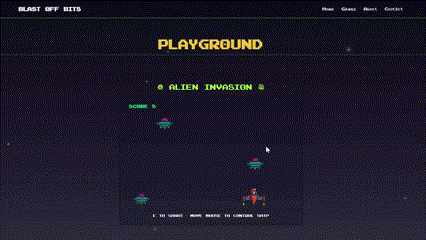

# Blast Off Bits - A Fictive Pixel Space Retro Gamejam

Welcome to **Blast Off Bits**, a fictive pixel space retro gamejam project! This project is a creative showcase of a 48-hour gamejam event, built with a unique retro pixel art style

## Preview




```sql

                    00XXXX                        0XXX00        
                    00XXxx                        0xXX00        
                    0e0000eeeeRR            0Reeee0000ee        
                          0xXX00            00XXxx              
                          0XXX00            00XXXX              
                    0exxXXXXXXXXXXXXXXXXXXXXXXXXXXXXxxee        
                    00XXXXeeee00XXXXXXXXXXXX00eeeeXXXX00        
                0xXXXXXXXX    00XXXXXXXXXXXX00    0XXXXXXXxx    
                0XXXXXXXXX    00XXXXXXXXXXXX00    0XXXXXXXXX    
            0eeeXXXXXXXXXXeeeeRRXXXXXXXXXXXXRReeeeXXXXXXXXXXeeee
            0XXXXXXXXXXXXXXXXXXXXXXXXXXXXXXXXXXXXXXXXXXXXXXXXXXX
            0XXX""""RRXXXXXXXXXXXXXXXXXXXXXXXXXXXXXXXXRR""""0XXX
            0XXX    00XXXXXXXXXXXXXXXXXXXXXXXXXXXXXXXX00    0XXX
            0XXX    00XXXX""""""""""""""""""""""""0XXX00    0XXX
            0XRR    00XXXX                        0XXX00    0RXX
            0eXX    00xxxxRR000000ee    0RRRRRRRXXXX00    0XXX
                          0xXXXXXXxx    0xxXXXXXXxx                            
                          0XXXXXXXXX    0XXXXXXXXX              
 

```

This project was created as an opportunity to enhance my skills in React and TypeScript


## Technologies Used

- **React**: For building the user interface.
- **TypeScript**: To ensure type safety and maintainable code.
- **GSAP**: For smooth animations and scroll-triggered effects.
- **Three.js**: To add 3D elements and enhance the retro aesthetic.

## How to Run

1. Clone the repository:
   ```bash
   git clone https://github.com/ben4ali/Pixel-GameJam.git
   cd pixel-gamejam
   ```

2. Install dependencies:
    ```bash
    npm install
    ```

3. Start the development server:
    ```bash
    npm start
    ```

4. Open your browser and navigate to `http://localhost:5713` to view the project.


## Credits

- **Pixel Font Credits**: The pixel fonts used in this project are credited in the [Font Credits](public/fonts/font-credits.md) file.


## License

This project is licensed under the MIT License. See the `LICENSE` file for details.